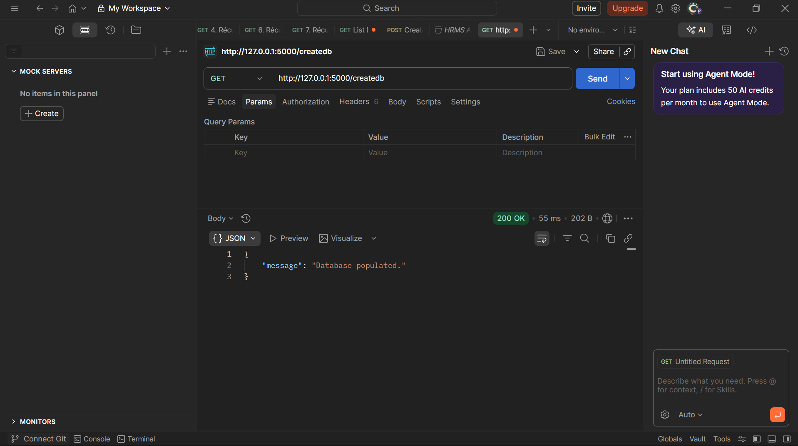
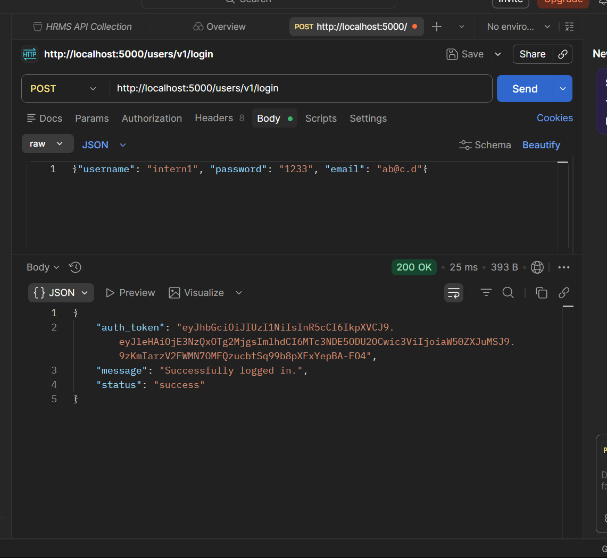
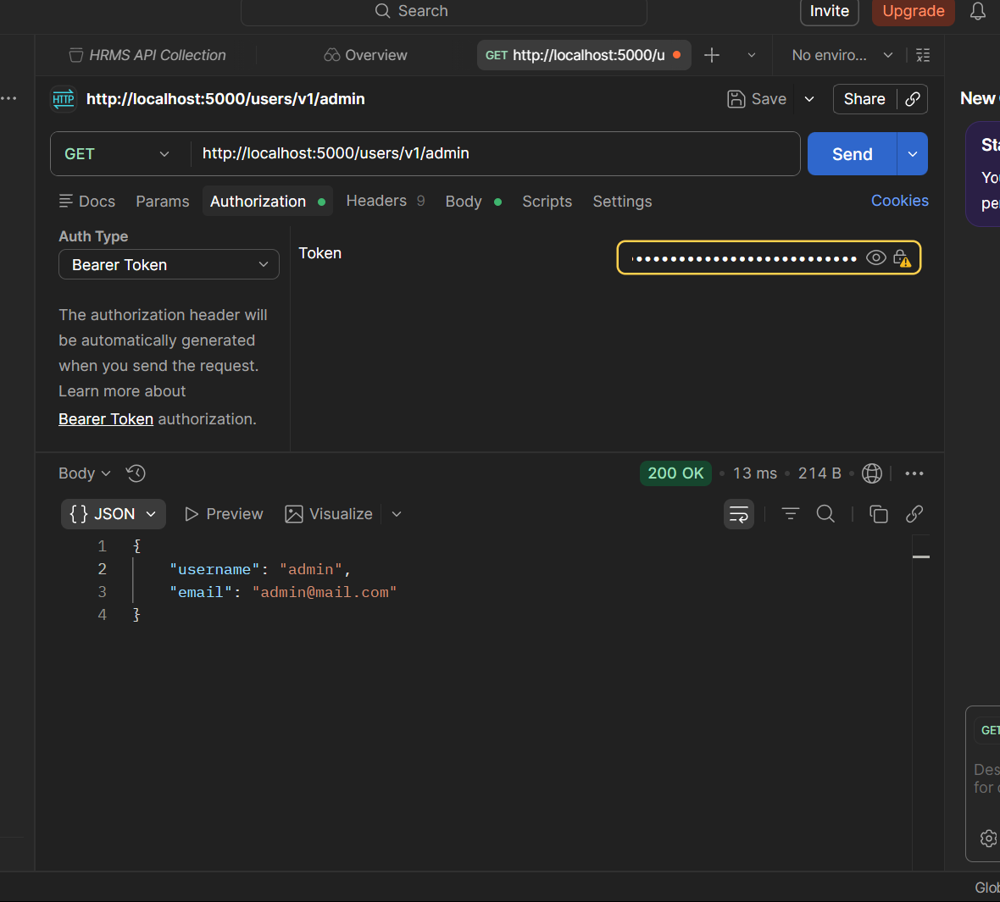
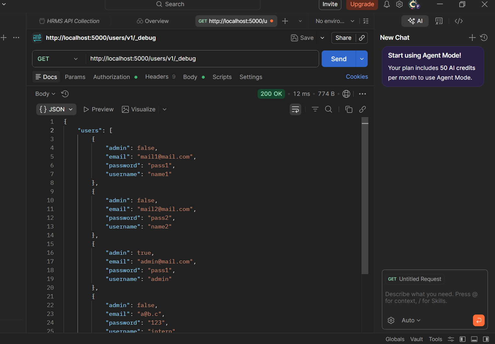
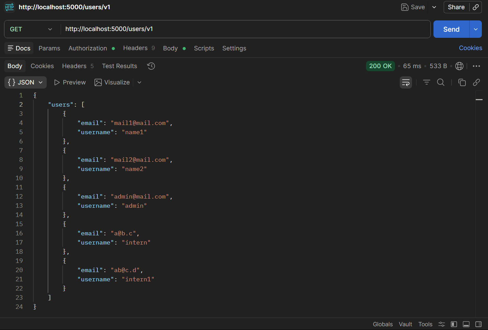

# FUTURE_CS_03 - API Security Risk Analysis

## Project Overview

This repository contains the deliverables for Task 3 of the Future Interns Cyber Security Track (2026).
The primary objective was to manually assess an API for design flaws, demonstrate practical exploitation of authorization vulnerabilities defined in the OWASP API Security Top 10, and produce a high-level executive report outlining the business risks and mitigation strategies.

## Target Environment

- Target API: VAmPI (Vulnerable API made with Flask)
- Deployment: Local, isolated Docker container (`erev0s/vampi`).
- Assessment Focus: Broken Object Level Authorization (BOLA), Broken Function Level Authorization (BFLA), Mass Assignment, and Security Misconfigurations.

## Methodology & Evidence

The assessment was conducted dynamically using Postman to intercept, modify, and replay API requests.

### 1. API Initialization & Authentication

The environment database was successfully provisioned, followed by the registration and authentication of a standard user account to obtain a valid JSON Web Token (JWT).

### 2. Broken Object Level Authorization (BOLA) - OWASP API1

By manipulating the Uniform Resource Identifier (URI) while holding a standard user token, the API failed to enforce object-level access controls, successfully returning the private details of the administrative user.

### 3. Excessive Data Exposure (BFLA) - OWASP API5

The API exposed an unauthenticated administrative diagnostic route (`/_debug`) which leaked the entire user database, including hashed passwords and internal system configurations.

### 4. Information Disclosure / User Enumeration

Without authentication, the `GET /users/v1` endpoint provided a complete directory of registered user accounts, exposing the API to targeted credential brute-forcing.

## Deliverables

- The final, professional API Security Risk Analysis Report (`.pdf` or `.docx`) outlining the strategic roadmap for zero-trust authorization.
- `vampi_exploit.py`: A custom-developed Python script automating the registration, login, and BOLA data extraction phases to demonstrate programmatic exploitation capabilities.
- `images/`: The complete archive of API request and response evidence captured via Postman.
